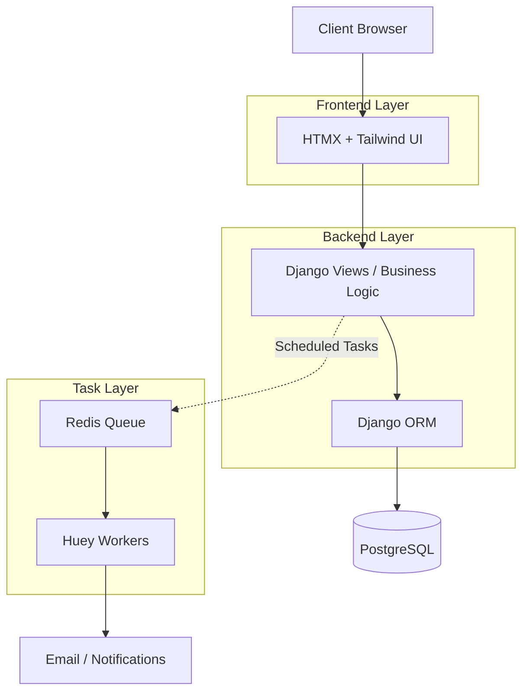

# System Architecture

```mermaid
graph TD
    Client[Client Browser]
    
    subgraph UI [Frontend Layer]
        HTMX[HTMX + Tailwind UI]
    end

    subgraph Logic [Backend Layer]
        Views[Django Views / Business Logic]
        ORM[Django ORM]
    end

    DB[(PostgreSQL)]

    subgraph Workers [Task Layer]
        Redis[Redis Queue]
        Huey[Huey Workers]
    end

    Notify[Email / Notifications]

    %% Flow
    Client --> HTMX
    HTMX --> Views
    Views --> ORM
    ORM --> DB
    
    %% Async Flow
    Views -.->|Scheduled Tasks| Redis
    Redis --> Huey
    Huey --> Notify
```